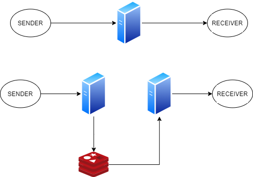
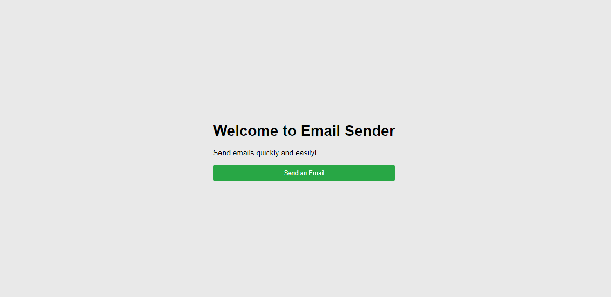
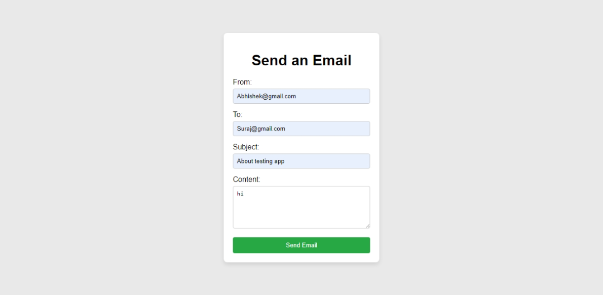

# Email Sender Application
 
## Overview
 
Send Email API is an efficient implementation of a message queue system designed to facilitate rapid email transfer. It is up to 100 times faster than conventional methods, capable of sending emails in approximately 20 milliseconds.

<p align="center">
<br> 
    Work Flow Diagram
</p>
 
## Features
 
- **Job Queue:** Utilizes Bull to manage email sending tasks asynchronously.
- **Email Sending:** Employs Nodemailer to send emails via a test SMTP server.
- **Form Reset:** Automatically resets the form fields after successful submission.
- **Alerts:** Provides feedback to users via alerts on form submission status.
 
## Technologies Used
 
- **Node.js:** JavaScript runtime for building server-side applications.
- **Express:** Web framework for Node.js.
- **Nodemailer:** Module to send emails from Node.js.
- **Bull:** A Redis-based queue for Node.js.
- **Redis:** In-memory data structure store, used by Bull for job queueing.
- **dotenv:** Module to load environment variables from a `.env` file.
 
## Project Structure
 
```
SEND-Email-API/
│
├── assets/
│   └── EmailForm.png
│   └── LandingPage.png
│   └── WorkFlow.png
│
├── controllers/
│   └── EmailController.js
│
├── models/
│   └── EmailModel.js
│
├── public/
│   └── styles.css
│
├── routes/
│   └── EmailRoutes.js
│   └── Landing.js
│
├── views
│   └── EmailForm.ejs
│   └── LandingPage.ejs
│
└── index.js
```
 
## Installation
 
### Prerequisites
 
- Node.js (v14 or higher)
- npm (v6 or higher)
- Redis
 
### Steps
 
1. **Clone the repository:**
 
```sh
git clone https://github.com/adityadahake/send-email-api.git
cd send-email-api
```
 
2. **Install dependencies:**
 
```sh
npm install
```
 
<!-- 3. **Set up environment variables:**
 
Create a `.env` file in the root directory and add your Redis URL:
 
```sh
REDIS_URL=redis://localhost:6379
``` -->
 
3. **Start Redis server:**
 
    Ensure you have Redis installed and running. If not, you can install it from [here](https://redis.io/download) and start the server:
 
```sh
redis-server
```
 
5. **Run the application:**
 
```sh
npm run dev
```
 
6. **Access the application:**
 
Open your browser and navigate to `http://localhost:4300/`.
 
## Usage
 
1. **Landing Page:**
   - Visit the landing page at `http://localhost:4300/`.
   - Click the "Send an Email" button to go to the email form.
   <p align="center">
    <br> 
    Landing Page
    </p>
 
2. **Email Form:**
   - Fill in the sender's email, recipient's email, subject, and message.
   - Click "Send Email" to submit the form.
   - An alert will notify you of the email's status, and the form will reset upon successful submission.
   <p align="center">
    <br> 
    Email Form
    </p>

3. **Send Email:**
    - **URL:** `/email/send`
    - **Method:** `POST`
    - **Description:** Submits the email form and queues the email sending task.
    - **Request Body:**
        - **from:** Sender's email address (string, required)
        - **to:** Recipient's email address (string, required)
        - **subject:** Subject of the email (string, required)
        - **text:** Content of the email (string, required)
    - **Response:**
        - **Status Code:** `200 OK`
        - **Content:**
            ```json
            {
            "message": "Email Sent"
            }
            ```
    - **Error Response:**
        - **Status Code:** `400 Bad Request`
        - **Content:**
            ```json
            {
            "message": "Failed to send email."
            }
            ```

## Contributing
 
We welcome contributions to improve the Email Sender Application. If you have any suggestions, please open an issue or submit a pull request.
 
## Acknowledgments
 
- We would like to thank freeCodeCamp for providing us with invaluable information and resources that greatly contributed to the development of this API.
- Thanks to the developers of Node.js, Express, Nodemailer, Bull, EJS, and Redis for their amazing tools.
- Special thanks to the open-source community for continuous support and contributions.
 
---
 